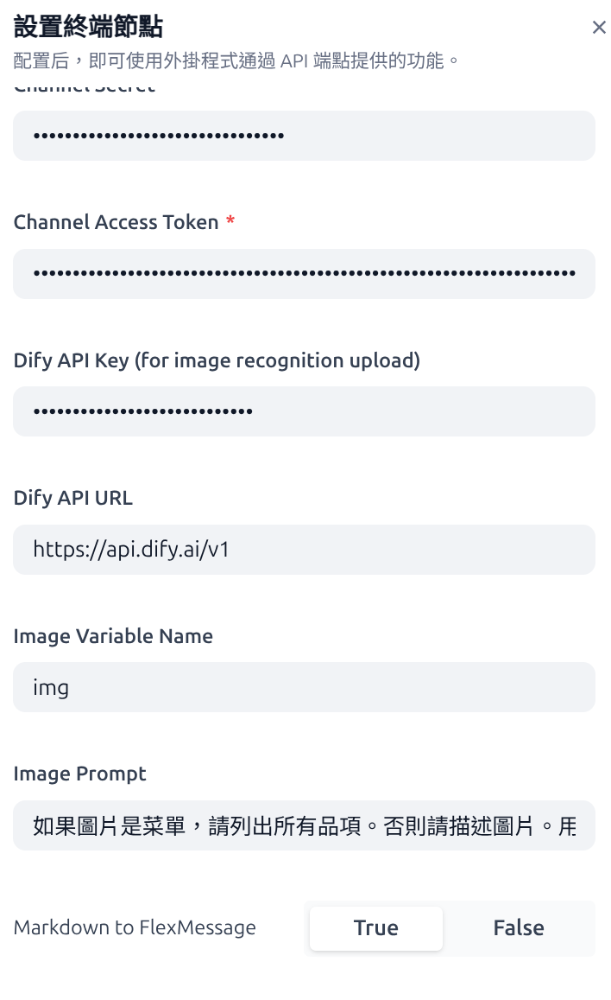
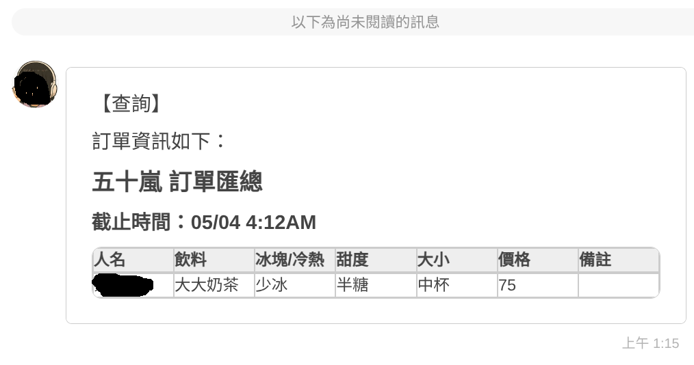

# Line Bot Plugin Integration Guide
Author: @kevintsai1202 (https://github.com/kevintsai1202/difyplugin.git)
Version: 0.0.5
Type: extension

## What's Changed
# 0.0.5
  1. Fix/New Feature: When group_id (LINE group chat), room_id (chat room) exist, Session uses group_id or room_id to save conversation_id. The effect is that group chats on Dify will maintain the same conversation. thanks to [@ryantsai](https://github.com/ryantsai]
  2. New Feature: When the message contains markdown, send to LINE as FlexMessage. Can be adjusted in Plugin parameters, default is off. thanks to [@ryantsai](https://github.com/ryantsai]
  3. New Feature: Image upload uses Dify API URL parameterization, supports community edition scenarios. thanks to [@ryantsai](https://github.com/ryantsai]

# 0.0.4
  1. Add the /clearconversationhistory command, thanks to [@ryantsai](https://github.com/ryantsai]
    When a user enters it on LINE, it will clear the session storage, and the next message sent to Dify will start a brand-new, clean session.
  2. Image message handling, thanks to [@ryantsai](https://github.com/ryantsai]
    Generate responses based on the uploaded images.
  3. Message Handling Enhancement, thanks to [@ryantsai](https://github.com/ryantsai]
    Added support for Markdown image URLs. `[url](http://xxx.xxx)`
  4. Handle image content in responses[@ryantsai](https://github.com/ryantsai]
    Ensure that generated images are properly displayed on LINE.
  5. Identifier Retrieval Support, thanks to [@jimcchi](https://github.com/jimcchi]
    Capture user_id, room_id, and group_id from incoming messages.

## Plugin Overview
The Line Bot plugin integrates the Dify chat workflow application with the Line Official Account Messaging API. It enables users to interact with AI through a Line Official Account. The plugin only processes message reception and responses; it does not store any user information.

## Setup Steps
Follow these steps to install and configure the Line Bot plugin:
1. Create a Provider and Messaging API Channel
  Go to the [LINE Developers](https://developers.line.biz) website。 
  

2. Copy the Channel Secret and Channel Access Token of the Messaging API
  - Navigate to the Basic settings page.
  - Copy the Channel Secret (if it hasn’t been generated yet, click "Issue" to create one).
  
  - Navigate to the Messaging API page.
  - Enable Use Webhook.
  - Copy the Channel Access Token (if it hasn’t been generated yet, click "Issue" to create one).
   

3. Set Up the Dify Line Bot Endpoint
  - Set an Endpoint Name.
  - Paste the Channel Secret and Channel Access Token.
  - Obtain the API Key for the Dify workflow.(option)
  - Set the image variable, and ensure that the workflow also configures the same file variable.
  - Select a Chat Workflow. 
  
  
  
  

4. Save and Copy the Line Bot Webhook URL
  

5. Set the Webhook URL and Verify
  - Return to the Messaging API page on the LINE Developers platform.
  - Paste the Webhook URL obtained in the previous step.
  - Verify the Line Bot. 
   
  
6. Use Line to add the Line Official Account and start chatting with AI.
  

  /clearconversationhistory
  

  Describe the image
  

  Generation image
  Sample ChatFlow on Dify using gpt-image-1 for generation(DSL file can be imported into Dify)
  

  <a href="https://github.com/user-attachments/files/19927343/LinebotImageChatSample.zip">LinebotImageChatSample.zip</a>

  FlexMessage
   